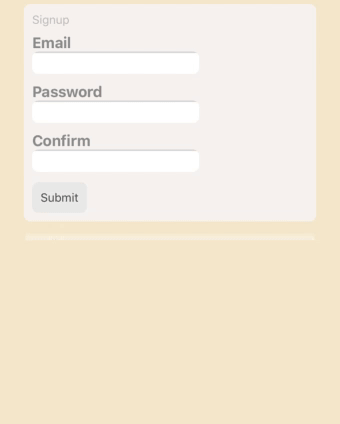

# react-helpers-web

components

- TransitionView ✅

hooks

- useScreenSize
- usePrevious ✅
- useBatchObjectState ✅
- useElementSize ✅
- useElementSizeEffect ✅

utils

- addFlex ✅
- addAbsolute ✅
- createStyleSheet ✅

### Getting Started

```ts
// package.json
"dependencies": { "react-helpers-web": "github:Conduct/react-helpers-web#v0.1.1" }
```

_installing a specific version tag helps to avoid unexpected updates_

## TransitonView

A wrapper to animate child components  
example uses:

- Accordion content
- Fading loading spinner
- Routing content transitions
- Auto animated lists / search results



Animate a views children by using a TransitionView, supporting

- crossfading
- sliding existing items
- auto height transitions

`NOTE: each child needs a unique key`  
_Hiding/showing form input error text_

```tsx
<TransitionView contentChangedKey={inlineErrorTexts.join("")} overflow="hidden">
  {hasVisibleErrors && (
    <div key={inlineErrorTexts.join("")} style={styles.errors}>
      {inlineErrorTexts.join(", ")}
    </div>
  )}
</TransitionView>
```

_Showing an animated list_

```tsx
<TransitionView contentChangedKey={wordList.join("")} slideExistingItems>
  {wordList.map((word) => (
    <div key={word} style={{ padding: 4, margin: 4 }}>
      <div> {word} </div>
    </div>
  ))}
</TransitionView>
```

_Props_

```ts
type Props = {
  contentChangedKey: string | boolean; // lets the component know the content has changed
  speed?: number; // multiplies the default speed (1.0 is default)
  cssStyle?: CSSObject;
  childWrapperStyle?: CSSObject; // for the view wrapping each child (to measure height)
  childOuterWrapperStyle?: CSSObject; // for the view wrapping each child wrapper (to set y position)
  renderWhenNoChildren?: boolean;
  overflow?: OverflowMode; // "hidden" | "visible" | "whenShrinking" | "whenGrowing"
  direction?: "vertical" | "horizontal"; // TODO
  children: FadableChild[] | FadableChild; // ReactElement | false | null | undefined
  initialChildHeight?: number;
  hasBackground?: boolean; // whether the faded content has a background, enabling this stops a flash of 0.5 opacity when fading between two items
  slideExistingItems?: boolean; // So children with same keys slide to new positions instead of fading out and in
} & ViewProps;
```

## Development

For a quick way to edit this package, add `📂src` to your project as a renamed local folder like `📂react-helpers-web-dev`, and replacing imports from `"react-helpers-web"` to `"react-helpers-web-dev"`.  
Enabling `"baseUrl":` in `tsconfig.json` allows non-relative imports
